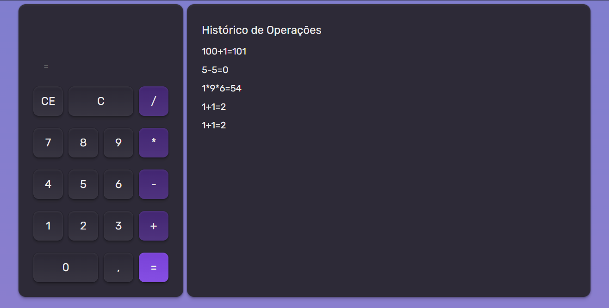

# 🧮 Calculadora React

## 📘 Sobre o Projeto

Este projeto foi desenvolvido durante o curso **Fundamentos em React**, com o objetivo de praticar e reforçar conceitos essenciais do React, como **componentização**, **estados** e **hooks**.  
A aplicação consiste em uma **calculadora funcional**, contendo as operações matemáticas básicas e um **histórico de operações**.

## 🚀 Tecnologias Utilizadas

- ⚛️ **React JS** — biblioteca principal para construção da interface  
- 🎨 **Tailwind CSS** — para estilização rápida e responsiva  
- 🔄 **React Hooks (useState, useEffect, useContext)** — para gerenciamento de estados e lógica de componentes.
- 📚 **LocalStorage** - Utilizado para salvar as operações do usuário em cache

